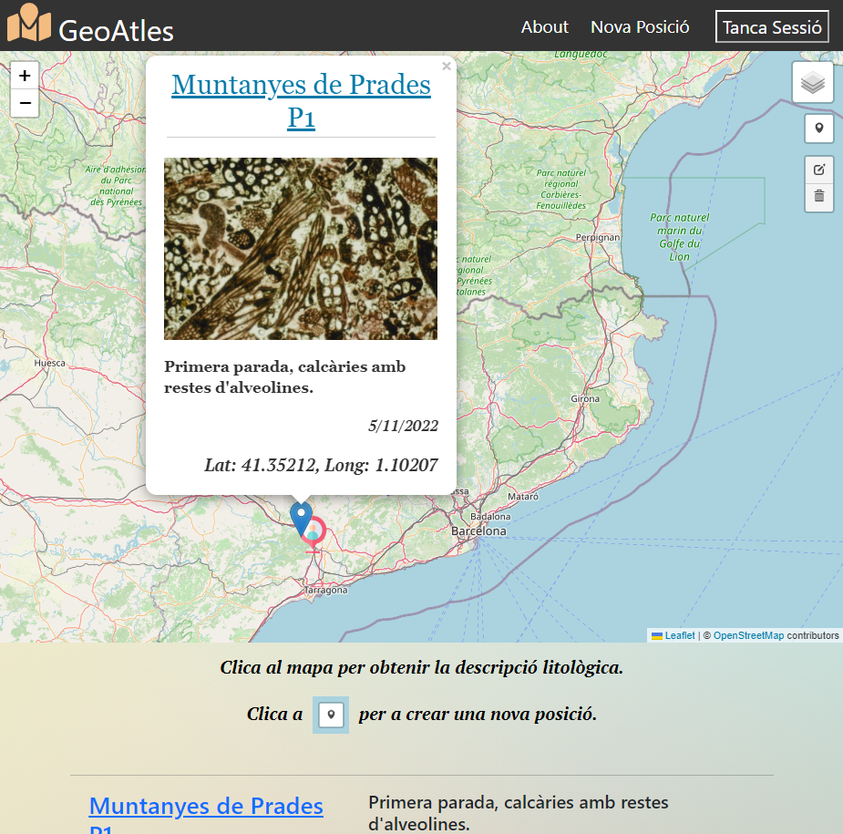

# Geo-app Serverless

## React, React-Leaflet serverless Rest api with user authentification using cognito.

* Geo-app allows the user to create edit and delete their own locations, descriptions and images on a geological,  orthographic and topographic maps being able to consult the geologic description from the ICGC maps.

[https://prod.d3323aethgy0tb.amplifyapp.com](https://prod.d3323aethgy0tb.amplifyapp.com)

Geologic WMS for GetFeatuesInfo: https://geoserveis.icgc.cat/arcgis/services/geologic/icgc_mg50m/MapServer/WMSServer?   

Source: [https://www.icgc.cat/Administracio-i-empresa/Serveis/Geologia/WMS-Cartografia-geologica](https://www.icgc.cat/Administracio-i-empresa/Serveis/Geologia/WMS-Cartografia-geologica)

      

wa\geoatlesserverless_new

